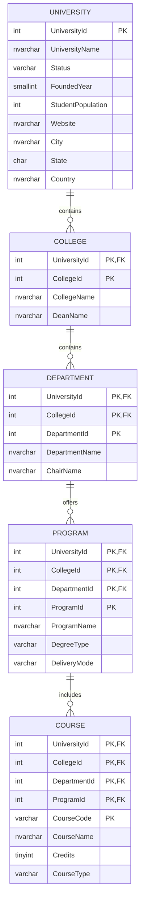

# University Relational Database ERD

The relational database preserves the hierarchy from each university JSON
document. Child identifiers repeat under different parents, so each child uses
its own identifier together with all parent identifiers as a composite primary
key. The same column names are used in every corresponding foreign key.

Location fields remain on `University` because each university document has
exactly one location and those fields describe the university directly.
