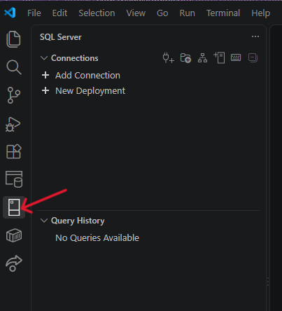
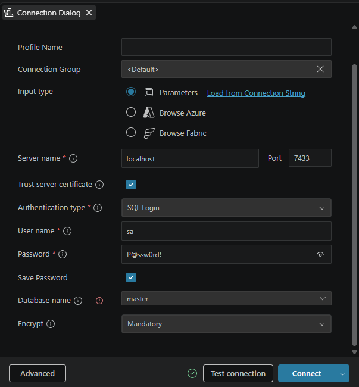
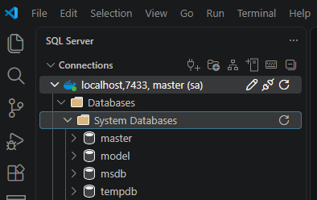
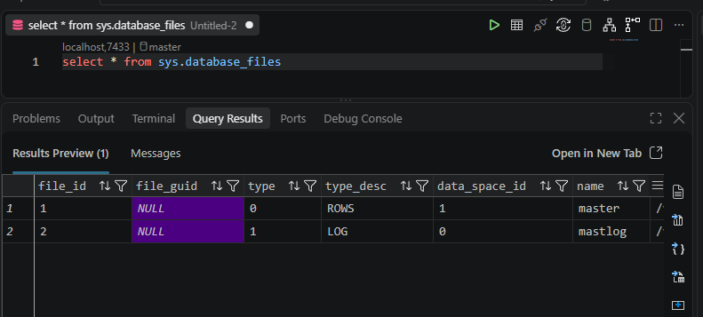

# SQL Server 2025 in Docker Desktop with VS Code

## Goal

By the end of this setup, you will:

- install Docker Desktop
- download the Microsoft SQL Server 2025 container image
- create a persistent Docker volume for your databases
- start SQL Server 2025 Enterprise Developer edition in a container
- install the required VS Code extensions in a dedicated **DBMS** profile
- connect to SQL Server from VS Code
- run a simple SQL query to verify that everything works

If you are new to Docker, VS Code profiles, SQL Server, or SQL, do not worry. Follow the steps in order and do not skip the verification checks.

---

## What these tools are

### Docker
Docker lets you run software in an isolated environment called a **container**.

- An **image** is the downloadable template.
- A **container** is the running instance of that image.
- A **volume** is persistent storage that survives even if the container is deleted.

For this course, Docker makes sure everyone uses the same SQL Server environment on Windows, macOS, and Linux.

### SQL Server
SQL Server is a database management system. It stores data in databases and lets you query that data with **SQL** (Structured Query Language).

### VS Code profile
A VS Code **profile** lets you keep class-specific extensions and settings separate from your normal development setup. For this course, we will use a profile named **DBMS**.

---

## Before you begin

Make sure you have:

- administrator access to your workstation
- a stable internet connection
- at least 10 GB of free disk space
- VS Code installed or permission to install it

For this guide, we will use:

- Docker volume name: `sqlserver-data1`
- container name: `sqlserver1`
- host port: `7433`
- SQL Server login: `sa`
- sample password: `dbms2026!`

> [!IMPORTANT]
> Use the same password everywhere in this guide unless your instructor tells you to choose a different one.
>
> If you do choose a different password, write it down exactly and update it in both the Docker command and the VS Code connection settings.

> [!CAUTION]
> Do **not** use `$`, backticks, or unquoted spaces in your password when you are first learning the setup process. Some shells interpret those characters before Docker receives them.

---

## 1. Install Docker Desktop

Install Docker Desktop for your operating system:

- **Windows:** [Docker Desktop for Windows](https://docs.docker.com/desktop/setup/install/windows-install/)
  - Most windows users when use the x86_64 version. 
- **macOS:** [Docker Desktop for Mac](https://docs.docker.com/desktop/setup/install/mac-install/)
  - M1, M2, M3, M4, etc... mac users will use the Apple silicon version.
  - If you have an older mac that does not have M chip, then you will use the Intel chip version.
- **Linux:** [Docker Desktop for Linux](https://docs.docker.com/desktop/setup/install/linux/)
  - Select your distribution and following the provided website instructions.
After installation:

1. Start Docker Desktop.
2. Wait until Docker Desktop shows that it is running.
3. Leave Docker Desktop open.

> [!NOTE]
> On Windows, Docker Desktop may ask you to enable WSL 2. Accept the prompt and complete that setup if needed.

> [!NOTE]
> On Apple Silicon Macs, Docker may warn you about platform differences. If you later see a platform mismatch error when starting SQL Server, use the Apple Silicon command shown in Step 5.

---

## 2. Confirm Docker is installed and working

Open a terminal:

- **Windows:** PowerShell
- **macOS:** Terminal
- **Linux:** Terminal

Run:

```bash
docker --version
```

You should see a Docker version number.

Next, test Docker end to end:

```bash
docker run hello-world
```

You should see a success message from Docker explaining that your installation appears to be working correctly.

If this command fails, stop here and fix Docker Desktop before continuing.

---

## 3. Download the Microsoft SQL Server 2025 container image

Run:

```bash
docker pull mcr.microsoft.com/mssql/server:2025-latest
```

This downloads the official Microsoft SQL Server container image from the Microsoft Container Registry.

### Apple Silicon Mac fallback

If Docker reports a platform mismatch on an M-series Mac, use:

```bash
docker pull --platform linux/amd64 mcr.microsoft.com/mssql/server:2025-latest
```

---

## 4. Create a persistent Docker volume

We want your databases and schema changes to survive container restarts. A Docker **volume** gives us that persistence.

Create the volume:

```bash
docker volume create sqlserver-data1
```

Confirm that it exists:

```bash
docker volume ls
```

Optional inspection command:

```bash
docker volume inspect sqlserver-data1
```

> [!CAUTION]
> Do **not** delete the volume unless you intentionally want to destroy your database files.

If you ever need to remove it anyway, the command is:

```bash
docker volume rm sqlserver-data1
```

---

## 5. Create and start the SQL Server container

### What this command does

The `docker run` command below:

- creates the container the first time you run it
- starts SQL Server in the background
- maps your workstation port `7433` to SQL Server port `1433` inside the container
- stores SQL Server data in the `sqlserver-data1` volume

### Important settings

- `ACCEPT_EULA=Y` accepts Microsoft's license terms
- `MSSQL_SA_PASSWORD=...` sets the password for the built-in `sa` administrator login
- `MSSQL_PID=EnterpriseDeveloper` uses the free Developer edition with full feature support for learning
- `--mount source=sqlserver-data1,target=/var/opt/mssql` persists your SQL Server data files
- `-d` runs the container in the background

### Standard command

Use this command on Windows, macOS, or Linux:

```bash
docker run -e "ACCEPT_EULA=Y" -e "MSSQL_SA_PASSWORD=dbms2026!" -e "MSSQL_PID=EnterpriseDeveloper" -p 7433:1433 --name sqlserver1 --hostname sqlserver1 --mount source=sqlserver-data1,target=/var/opt/mssql -d mcr.microsoft.com/mssql/server:2025-latest
```

### Apple Silicon Mac version

If needed on an M-series Mac, use:

```bash
docker run --platform linux/amd64 -e "ACCEPT_EULA=Y" -e "MSSQL_SA_PASSWORD=dbms2026!" -e "MSSQL_PID=EnterpriseDeveloper" -p 7433:1433 --name sqlserver1 --hostname sqlserver1 --mount source=sqlserver-data1,target=/var/opt/mssql -d mcr.microsoft.com/mssql/server:2025-latest
```

### Verify that the container is running

Run:

```bash
docker ps
```

You should see a running container named `sqlserver1`.

If you do **not** see it, check the logs:

```bash
docker logs sqlserver1
```

Common reasons for failure:

- the password does not meet SQL Server complexity requirements
- Docker Desktop is not fully running
- port `7433` is already in use

> [!NOTE]
> The `docker run` command is mainly for the **first** creation of the container. After the container already exists, use `docker start sqlserver1` instead of running `docker run` again.

---

## 6. Useful Docker commands for this course

These are not required right now, but they will help later.

### Stop the container

```bash
docker stop sqlserver1
```

### Start the container again

```bash
docker start sqlserver1
```

### Restart the container

```bash
docker restart sqlserver1
```

### See all containers, including stopped ones

```bash
docker ps -a
```

### View container logs

```bash
docker logs sqlserver1
```

> [!TIP]
> If your VS Code connection suddenly fails, first confirm that Docker Desktop is open and then run `docker ps` to make sure `sqlserver1` is still running.

---

## 7. Install or update Visual Studio Code

If you do not already have VS Code, install it here:

- [Visual Studio Code](https://code.visualstudio.com/)

If VS Code is already installed, update it to the latest version before continuing.

---

## 8. Create and use a VS Code profile named DBMS

Using a dedicated profile keeps your database tools separate from your other coursework or development tools.

### Create the profile from the VS Code interface

1. Open VS Code.
2. Select the **gear icon** in the lower-left corner.
3. Choose **Profiles**.
4. Create a new profile named **DBMS**.
5. Switch to that profile.

### Command-line option

If the `code` command is available in your terminal, you can open VS Code with the profile by running:

```bash
code --profile DBMS
```

> [!NOTE]
> If `code` is not recognized:
>
> - on **Windows**, reinstall or update VS Code and make sure the option to add `code` to PATH is enabled
> - on **macOS**, open VS Code and run **Shell Command: Install 'code' command in PATH** from the Command Palette
> - on **Linux**, the `code` command is usually installed automatically with VS Code

---

## 9. Install the required VS Code extensions

There are two ways to do this. Use either the **Extensions panel** or the **terminal commands** below.

### Recommended: install from the Extensions panel

With the **DBMS** profile selected, open the Extensions panel and install:

- Markdown Preview Mermaid Support (`bierner.markdown-mermaid`)
- Docker (`ms-azuretools.vscode-containers`)
- MSSQL (`ms-mssql.mssql`)
- SQL Bindings (`ms-mssql.sql-bindings-vscode`)
- SQL Database Projects (`ms-mssql.sql-database-projects-vscode`)
- Data Workspace (`ms-mssql.data-workspace-vscode`)
- Live Share (`ms-vsliveshare.vsliveshare`)

### Command-line option

If the `code` command works on your machine, run:

```bash
code --profile DBMS --install-extension bierner.markdown-mermaid
code --profile DBMS --install-extension ms-azuretools.vscode-containers
code --profile DBMS --install-extension ms-mssql.data-workspace-vscode
code --profile DBMS --install-extension ms-mssql.mssql
code --profile DBMS --install-extension ms-mssql.sql-bindings-vscode
code --profile DBMS --install-extension ms-mssql.sql-database-projects-vscode
code --profile DBMS --install-extension ms-vsliveshare.vsliveshare
```

### Course MCP servers

Using the Extensions panel, search for and install:

- `@mcp microsoftdocs`
- `@mcp com.microsoft/nuget`

After the extensions finish installing, restart VS Code.

---

## 10. Connect to SQL Server from VS Code

1. Reopen VS Code if needed.
2. Make sure the **DBMS** profile is selected.
3. Confirm that Docker Desktop is running.
4. Confirm that your SQL Server container is running:

   ```bash
   docker ps
   ```

5. In the Activity Bar on the left, select the **SQL Server** extension icon.
6. Click **Add Connection**.



Use these connection settings:

- **Server name:** `localhost`
- **Port:** `7433`
- **Trust server certificate:** checked
- **Authentication type:** `SQL Login`
- **User name:** `sa`
- **Password:** `dbms2026!`
- **Save Password:** checked
- **Database name:** `master`
- **Encrypt:** `Mandatory`

> [!NOTE]
> If you used a different port or password earlier, enter those values instead.

Click **Test Connection**.

If the test succeeds, click **Connect**.
 
---

## 11. Verify that SQL Server is working

After connecting, you should be able to expand:

- your `localhost` server connection
- **Databases**
- **System Databases**

You should see the SQL Server system databases:

- `master`
- `model`
- `msdb`
- `tempdb`



### Run a test query

1. Right-click the `master` database.
2. Select **New Query**.
3. Enter the following SQL:

```sql
SELECT * FROM sys.database_files;
```

4. Select the query text.
5. Right-click the selected text.
6. Choose **Execute Query (MSSQL)**.

The **Query Results** pane should return rows describing the files for the `master` database. In a default setup, you should typically see two rows.

If you see results, your environment is working correctly.



---

## 12. Submit proof of completion

Take **one screenshot** that clearly shows:

- the SQL Server extension panel
- the query you typed
- the query results

Upload the screenshot to Canvas.

---

## Troubleshooting

### `docker --version` works, but `docker run hello-world` fails

Docker Desktop is probably installed but not fully running yet. Open Docker Desktop and wait until it finishes starting.

### The SQL Server container starts and then immediately stops

Run:

```bash
docker logs sqlserver1
```

Most often this means:

- the password was too weak
- the port was already in use
- the image did not finish downloading correctly

### VS Code cannot connect to SQL Server

Check all of the following:

- Docker Desktop is running
- `docker ps` shows `sqlserver1`
- you used `localhost` and port `7433`
- you used the correct `sa` password
- **Trust server certificate** is checked
- **Encrypt** is set to **Mandatory**

### I deleted the container by mistake

If the volume still exists, your databases may still be safe. Recreate the container using the same volume name:

```bash
docker volume ls
docker run -e "ACCEPT_EULA=Y" -e "MSSQL_SA_PASSWORD=dbms2026!" -e "MSSQL_PID=EnterpriseDeveloper" -p 7433:1433 --name sqlserver1 --hostname sqlserver1 --mount source=sqlserver-data1,target=/var/opt/mssql -d mcr.microsoft.com/mssql/server:2025-latest
```

### Docker says the container name is already in use

That usually means the container already exists but is stopped. Check:

```bash
docker ps -a
```

If `sqlserver1` is listed, start it with:

```bash
docker start sqlserver1
```

### I removed the volume

If you removed `sqlserver-data1`, your saved databases are gone and you must start over from Step 4.

---

## Success checklist

You are done when all of the following are true:

- Docker Desktop is installed and running
- `docker run hello-world` succeeds
- the SQL Server image has been downloaded
- the `sqlserver-data1` volume exists
- the `sqlserver1` container is running
- VS Code is using the **DBMS** profile
- the required extensions are installed
- VS Code connects successfully to SQL Server
- your test query returns results